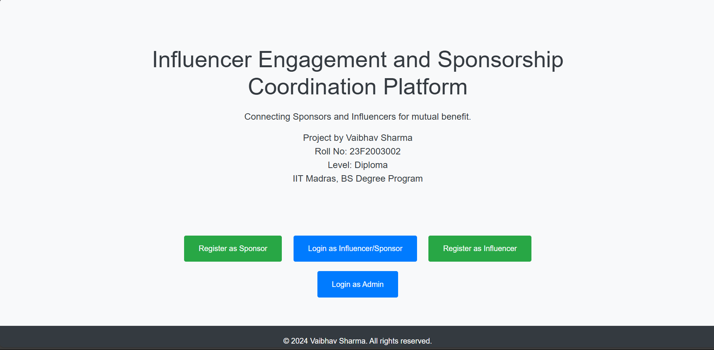
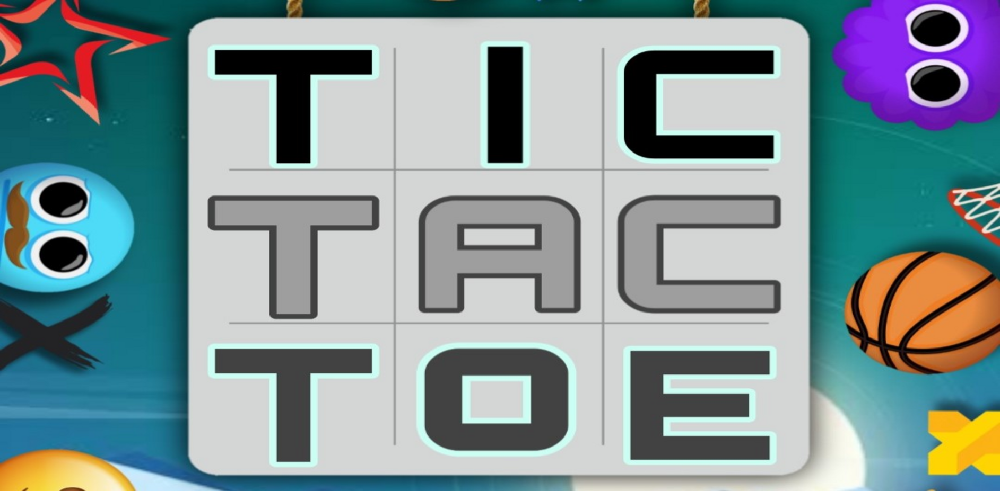
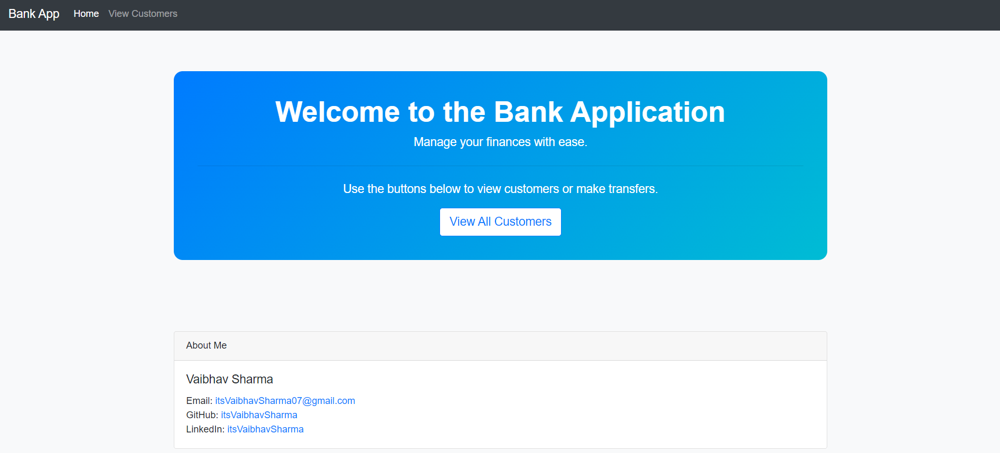

# Hi, I'm Vaibhav Sharma 👋

  

Welcome to my GitHub portfolio! I am a passionate **full-stack developer** with expertise in **Artificial Intelligence**, **Data Science**, and **Web Development**. I am currently pursuing B.Tech at **Madhav Institute of Technology & Science** and B.S at **Indian Institute of Technology, Madras**.

I enjoy building applications that solve real-world problems, contributing to open-source, and continually learning new technologies.

---

### 👨‍💻 What I have done:

- **Full-Stack Development**: Proficient in developing dynamic web applications utilizing **Flask** and **Django** with **jinja2 & Vue.js** for the frontend.
- **Database Management**: Experience with SQL and NoSQL databases, including **MySQL**, **SQLite**, and **PostgreSQL**, facilitating effective data management.
- **Frontend Technologies**: Skilled in creating responsive user interfaces with **HTML**, **CSS** and **Bootstrap**.
- **Data Analysis & Visualization**: Proficient in data analysis and visualization using **Pandas**, **Numpy**, **Matplotlib**, and **Charts.js**.
- **Version Control**: Utilization of **Git** and **GitHub** for effective version control and collaboration.
- **API Development**: Capability in designing and integrating **RESTful APIs**, enhancing communication between client and server.

### 🌱 What I am doing:

- Working on building projects and hackathons.

### 🚀 What I will do:

- Continue creating projects in AI, ML, and full-stack web development.
- Explore AR/VR technologies and enhance my machine learning skills.

---

## 🔗 Contact and Social Media:

  
  
  
  

---

## 🛠️ Skills:

### Languages:

  
  
  
  
  

### Technologies & Tools:

  

---

## 📂 Projects:

<table style="padding: 20px; border-spacing: 30px;">
  <tr>
    <td align="center" width="50%" style="padding: 20px;">
      

         
        <strong>Sponsor-Influencer Coordination Platform</strong> 
        
Technologies: Python, Flask, SQLite, Jinja2

        
        
      

    </td>
    <td align="center" width="50%" style="padding: 20px;">
      

         
        <strong>TicTacToe Android Game</strong> 
        
Technologies: Java, Android Studio, Firebase

        
      

    </td>
  </tr>
  <tr>
    <td align="center" width="50%" style="padding: 20px;">
      

         
        <strong>Student Database Management System</strong> 
        
Technologies: C++, Vectors, Linked Lists ,  File I/O

        

          
        

      

    </td>
    <td align="center" width="50%" style="padding: 20px;">
      

         
        <strong>Basic Banking Application</strong> 
        
Technologies: MySQL, Node.js, Express, Bootstrap

        

          
          
        

      

    </td>
  </tr>
  <tr>
    <td align="center" width="50%" style="padding: 20px;">
      

         
        <strong>To-Do List Management System</strong> 
        
Technologies: C++, Vectors, Linked Lists, File I/O

        

          
        

      

    </td>
    <td align="center" width="50%" style="padding: 20px;">
      

         
        <strong>Phone Directory Management System</strong> 
        
Technologies: C++, Linked List, File I/O, CSV

        

          
        

      

    </td>
  </tr>
</table>

---

## 🎓 Certificates:

- [CS50’s Introduction to Programming with Python from Harvard University](https://certificates.cs50.io/fe81723e-d4e4-4fca-a03e-535eff7fc93e.pdf?size=letter)
- [Communication Skills - Oxford Home Study Center](https://oxford-home-study-link.com)
- 10 Courses and 1 Certification from **Infosys Springboard**.
- Certificate of Appreciation (qualified round 2 of 3) issued by IETE for qualifying round 2 of CODATHON 2.0, inter-college
  coding competition held at MITS, Gwalior.

---

## 🏆 Achievements:

- Led a team of 6 for **Smart India Hackathon** Internal round and successfully shortlisted for the national round 1, on Sep 07, 2024.
- Achieved **Highest SGPA** in the department in Semester 1 (9.37) and in the college in Semester 2 (9.63).

---

<h2 style="font-size: 2em; margin-bottom: 15px; color: #333;">💼 Experience</h2>

  <strong>Intern - The Spark Foundation</strong>
   Web Development & Designing
   Completed in August 2024

